# Udacity Machine Learning Engineer with Microsoft Azure Capstone Project

## Table of Contents
* [Overview](#Overview)
* [Dataset](#Dataset)
    * [Dataset Overview](#Dataset-Overview)
    * [Data dictionary](#Data-dictionary)
    * [Sector catalogue](#Sector-catalogue)
    * [Entities catalogue](#Entities-catalogue)
    * [Yes-No catalogue](#Yes-No-catalogue)
    * [Laboratory result catalogue](#Laboratory-result-catalogue)
    * [Final Classification catalogue](#Final-Classification-catalogue)
    * [Task](#Task)
    * [Access](#Access)
* [Automated ML](#Automated-ML)
    * [AutoML Results](#AutoML-Results)
    * [Possible Impromevents for AutoML](#Possible-Impromevents-for-AutoML)
* [Hyperparameter Tuning](#Hyperparameter-Tuning)
    * [Hyperdrive Results](#Hyperdrive-Results)
    * [Possible Improvements for Hyperdrive](#Possible-Improvements-for-Hyperdrive)
* [Model Deployment](#Model-Deployment)
* [Screen Recording](#Screen-Recording)
* [References](#References)
## Overview

This is the capstone project for the Udacity Machine Learning Engineer with Microsoft Azure.

In this project we analize the Mexican Government's data for the COVID-19 pandemic from January of 2020 up until the 10th of May of 2021. From this data we intend to get a predictive model to analyze if a patient will enter an Intensive Care Unit (ICU) or not, based on their COVID-19 lab test result, age, gender and comorbidities.

This is the project workflow that was followed.


1. Choose a dataset: The dataset chosen for the project is the Mexican Government's General Directorate of Epidemiology COVID-19 Open Data. Available to download in the following URL: https://www.gob.mx/salud/documentos/datos-abiertos-152127
2. Import Dataset into workspace: The dataset in CSV format is registered in the Datasets tab in Azure ML Studio to be used for training.
3. Train model using Automated ML: Using the AzureML SDK for Python a Jupyter Notebook is created where a classification model using AutoML is trained, and the one with the most accuracy is selected.
4. Train model using HyperDrive: Using the AzureML SDK for Python a Jupyter Notebook is created where a classification model using HyperDrive for hyperparameter optimization is trained and the model with the most accuracy is selected.
5. Compare model performance: The two models are compared and the one with the best accuracy is selected for deployment.
6. Deploy best model: The best model is deployed using Azure Container Instances, a functional endpoint is produced and logging is enabled with Application Insights.
7. Test model endpoint: We test the model endpoint with test data.

## Project Set Up and Installation
Azure ML Studio already has all the libraries we need except for two, `imblearn` and `azureml-train-automl-runtime`, `imblearn` library helps us to balance our training sample by undersampling the class with more data, thus creating a balanced dataset. Before starting to run the notebooks please run the following command on the notebook or on the terminal:
```Python
pip install imblearn
```

We will also need to update some libraries already present in AzureML, please run the following commands:
```Python
pip install azureml-train-automl-runtime
pip install --upgrade azureml-sdk[notebooks,contrib,automl] azureml-widgets
pip install --upgrade scikit-learn
```
We will also need the CSV file with the data which can be downloaded in the URL previously mentioned, this file is around 1 GB in size, so please start the download in advance.

## Dataset

### Dataset Overview
As explained before, the dataset is from the Mexican Government's General Directorate of Epidemiology COVID-19 Open Data. We are given a description for each column of the dataset in a dictionary, and the posible values for each column in catalogues.

### Data dictionary
| # | Variable Name         | Variable Description (With English translation) | Format |
|---|-----------------------|----------------------|--------|
|1  |FECHA_ACTUALIZACION    |(Update date) The last date the database was updated, this variable allows to identify the date of the last update.                     |AAAA-MM-DD        |
|2  |ID_REGISTRO            |(Registry ID) Case identifier number                      |Text        |
|3  |ORIGEN                 |(Origin) Sentinel surveillance is carried out through the respiratory disease monitoring health unit system (USMER). The USMER include medical units of the first, second or third level of care, and third level units also participate as USMERs, which due to their characteristics contribute to broadening the epidemiological information panorama, including those with a specialty in pulmonology, infectology or pediatrics. . (Categories in Annex Catalog).                      | 1 = USMER, 2 = Outside USMER, 99 = Not Specified        |
|4  |SECTOR                 |(Sector) Identifies the type of institution of the National Health System that provided the care.                      |[Sector catalogue](#Sector-catalogue)        |
|5  |ENTIDAD_UM             |(Entity) Identifies the entity (state) where the medical unit that provided the care is located.                      |[Entities catalogue](#Entities-catalogue)        |
|6  |SEXO                   |(Sex) Identifies the sex of the patient.                      |1 = Woman, 2 = Man, 99 = Not specified     |
|7  |ENTIDAD_NAC            |(Entity of birth) Identifies the patient's birth entity (state).                     |[Entities catalogue](#Entities-catalogue)        |
|8  |ENTIDAD_RES            |(Entity of residence) Identifies the entity (state) of residence of the patient.                      |[Entities catalogue](#Entities-catalogue)        |
|9  |MUNICIPIO_RES          |(Municipality of residence) Identifies the municipality of residence of the patient.                     | *Catalogue has 2,500 rows and was not included for simplicity, but 997 = Does not apply, 998 = Ignored, 999 = Not specified       |
|10 |TIPO_PACIENTE          |(Patient care type) Identifies the type of care the patient received in the unit. It is called ambulatory if the patient returned home or it is called hospitalized if it was admitted to the hospital.                      | 1 = Ambulatory, 2 = Hospitalized, 99 = Not specified    |
|11 |FECHA_INGRESO          |(Date of entry) Identifies the date of admission of the patient to the care unit.                      |AAAA-MM-DD        |
|12 |FECHA_SINTOMAS         |(Date of symptoms) Identifies the date on which the patient's symptoms began.                    |AAAA-MM-DD        |
|13 |FECHA_DEF              |(Date of death) Identifies the date the patient died if it did. If it did not die the date is displayed as 9999-99-99                      |AAAA-MM-DD        |
|14 |INTUBADO               |(Intubated) Identifies if the patient required intubation.                      |[Yes-No catalogue](#Yes-No-catalogue)        |
|15 |NEUMONIA               |(Pneumonia) Identifies if the patient was diagnosed with pneumonia.                     |[Yes-No catalogue](#Yes-No-catalogue)        |
|16 |EDAD                   |(Age) Identifies the age of the patient                      | Numeric in years       |
|17 |NACIONALIDAD           |(Nationality) Identifies if the patient is Mexican or foreign.                      | 1 = Mexican, 2 = Foreign, 99 = Not specified       |
|18 |EMBARAZO               |(Pregnancy) Identifies if the patient is pregnant.                     |[Yes-No catalogue](#Yes-No-catalogue)        |
|19 |HABLA_LENGUA_INDIG     |(Speaks indigenous language) Identifies if the patient speaks an indigenous language.                      |[Yes-No catalogue](#Yes-No-catalogue)        |
|20 |INDIGENA               |(Indigenous person) Identifies if the patient self-identifies as an indigenous person.                      |[Yes-No catalogue](#Yes-No-catalogue)        |
|21 |DIABETES               |(Diabetes) Identifies if the patient has a diagnosis of diabetes.                      |[Yes-No catalogue](#Yes-No-catalogue)        |
|22 |EPOC                   |(COPD) Identifies if the patient has a COPD (Chronic Obstructive Pulmonary Disease) diagnosis.                      |[Yes-No catalogue](#Yes-No-catalogue)        |
|23 |ASMA                   |(Asthma) Identifies if the patient has a diagnosis of asthma.                     |[Yes-No catalogue](#Yes-No-catalogue)        |
|24 |INMUSUPR               |(Immunosuppression) Identifies if the patient is immunosuppressed.                      |[Yes-No catalogue](#Yes-No-catalogue)        |
|25 |HIPERTENSION           |(Hypertension) Identifies if the patient has a diagnosis of hypertension.                     |[Yes-No catalogue](#Yes-No-catalogue)        |
|26 |OTRAS_COM              |(Other comorbidities) Identifies if the patient has a diagnosis of other diseases.                     |[Yes-No catalogue](#Yes-No-catalogue)        |
|27 |CARDIOVASCULAR         |(Cardiovascular disease) Identifies if the patient has a diagnosis of cardiovascular disease.                     |[Yes-No catalogue](#Yes-No-catalogue)        |
|28 |OBESIDAD               |(Obesity) Identifies if the patient has a diagnosis of obesity.                      | [Yes-No catalogue](#Yes-No-catalogue)       |
|29 |RENAL_CRONICA          |(Chronic kidney failure) Identifies if the patient has a diagnosis of chronic kidney failure.                      |[Yes-No catalogue](#Yes-No-catalogue)        |
|30 |TABAQUISMO             |(Smoking) Identifies if the patient has a smoking habit.                      |[Yes-No catalogue](#Yes-No-catalogue)        |
|31 |OTRO_CASO              |(Other case) Identifies if the patient had contact with any other case diagnosed with SARS CoV-2                      |[Yes-No catalogue](#Yes-No-catalogue)        |
|32 |TOMA_MUESTRA_LAB       |(Laboratory sample taken) Identifies if the patient had a laboratory sample taken.                      | [Yes-No catalogue](#Yes-No-catalogue)       |
|33 |RESULTADO_LAB          |(Laboratory sample result) Identifies the result of the analysis of the sample reported by the laboratory of the National Network of Epidemiological Surveillance Laboratories (INDRE, LESP and LAVE) and private laboratories endorsed by InDRE whose results are registered in SISVER.                      |[Laboratory result catalogue](#Laboratory-result-catalogue)        |
|34 |TOMA_MUESTRA_ANTIGENO  |(Antigen sample taken) Identifies if the patient had an antigen sample for SARS-CoV-2                      |[Yes-No catalogue](#Yes-No-catalogue)        |
|35 |RESULTADO_ANTIGENO     |(Antigen sample result) Identifies the result of the analysis of the antigen sample taken from the patient                      | 1 = Positive to SARS-CoV-2, 2 = Negative to SARS-CoV-2, 99 = Does not apply (case without sample)      |
|36 |CLASIFICACION_FINAL    |(Final classification) Identifies if the patient is a case of COVID-19 according to the Final classification catalog.                      |[Final Classification catalogue](#Final-Classification-catalogue)        |
|37 |MIGRANTE               |(Migrant) Identifies if the patient is a migrant person.                      |[Yes-No catalogue](#Yes-No-catalogue)        |
|38 |PAIS_NACIONALIDAD      |(Nationality) Identifies the nationality of the patient.                      |Text, 99 = Ignore        |
|39 |PAIS_ORIGEN            |(Country of origin) Identifies the country from which the patient departed for Mexico.                      |Text, 97 = Does not apply        |
|40 |UCI                    |(ICU) Identifies if the patient required admission to an Intensive Care Unit.                      |[Yes-No catalogue](#Yes-No-catalogue)        |

### Sector catalogue
| Key | Value |
|-----|-------|
|1    |CRUZ ROJA       |
|2    |DIF       |
|3    |ESTATAL       |
|4    |IMSS       |
|5    |IMSS-BIENESTAR       |
|6    |ISSSTE       |
|7    |MUNICIPAL       |
|8    |PEMEX       |
|9    |PRIVADA       |
|10   |SEDENA       |
|11   |SEMAR       |
|12   |SSA       |
|13   |UNIVERSITARIO       |
|99   |NO ESPECIFICADO       |

### Entities catalogue
| Key | Value | Abbreviation
|-----|-------|-----|
|01	|AGUASCALIENTES	|AS|
|02	|BAJA CALIFORNIA|	BC|
|03	|BAJA CALIFORNIA SUR|	BS|
|04	|CAMPECHE	|CC|
|05	|COAHUILA	|CL|
|06	|COLIMA	|CM|
|07	|CHIAPAS	|CS|
|08	|CHIHUAHUA	|CH|
|09	|CIUDAD DE MÉXICO	|DF|
|10	|DURANGO	|DG|
|11	|GUANAJUATO	|GT|
|12	|GUERRERO	|GR|
|13	|HIDALGO	|HG|
|14	|JALISCO	|JC|
|15	|MÉXICO	|MC|
|16	|MICHOACÁN 	|MN|
|17	|MORELOS	|MS|
|18	|NAYARIT	|NT|
|19	|NUEVO LEÓN	|NL|
|20	|OAXACA	|OC|
|21	|PUEBLA	|PL|
|22	|QUERÉTARO	|QT|
|23	|QUINTANA ROO	|QR|
|24	|SAN LUIS POTOSÍ	|SP|
|25	|SINALOA	|SL|
|26	|SONORA	|SR|
|27	|TABASCO	|TC|
|28	|TAMAULIPAS	|TS|
|29	|TLAXCALA	|TL|
|30	|VERACRUZ 	|VZ|
|31	|YUCATÁN	|YN|
|32	|ZACATECAS	|ZS|
|36	|ESTADOS UNIDOS MEXICANOS (UNITED MEXICAN STATES)	|EUM|
|97	|NO APLICA	(Does not apply)|NA|
|98	|SE IGNORA	(Ignored)|SI|
|99	|NO ESPECIFICADO	(Not specified)|NE|

### Yes-No catalogue
| Key | Value |
|-----|-------|
|1    |Yes       |
|2    |No       |
|97   |Des not apply       |
|98   |Ignored       |
|99   |Not specified       |

### Laboratory result catalogue
| Key | Value |
|-----|-------|
|1    |Positive to SARS-COV-2       |
|2    |Negative to SARS-COV-2       |
|3    |Pending result       |
|4    |Unsuitable result       |
|97   |Does not apply (case without sample)       |

### Final Classification catalogue
| Key | Value | Description
|-----|-------|-----|
|1    | COVID-19 CASE CONFIRMED BY EPIDEMIOLOGICAL CLINICAL ASSOCIATION | "Confirmed by association applies when the case reported being a positive contact for COVID-19 (and this is registered in SISVER) and: The case was not sampled or the sample was invalid. " |
|2    | COVID-19 CASE CONFIRMED BY DICTAMINATION COMMITTEE | "Confirmed by ruling only applies to deaths under the following conditions: The case was not sampled or a sample was taken, but the sample was invalid." |
|3    | CONFIRMED SARS-COV-2 CASE | "Confirmed applies when: The case has a laboratory sample or antigenic test and was positive for SARS-CoV-2, regardless of whether the case has a clinical epidemiological association. "|
|4    | INVALID BY LABORATORY | Invalid applies when the case does not have a clinical epidemiological association, nor a COVID-19 ruling. A laboratory sample was taken and it was invalid. |
|5    | NOT PERFORMED BY LABORATORY | Not carried out applies when the case does not have a clinical epidemiological association, nor a ruling on COVID-19 and a laboratory sample was taken and it was not processed. |
|6    | SUSPECT CASE | "Suspect applies when: The case does not have a clinical-epidemiological association, or a COVID-19 ruling and no sample was taken, or a laboratory sample was taken and the result is pending, regardless of another condition. " |
|7    | NEGATIVE TO SARS-COV-2 | "Negative applies when the case: 1. A laboratory sample was taken and it was: negative for SARS-COV-2 or positive for any other respiratory virus (Influenza, RSV, Bocavirus, others) regardless of whether this case has a clinical-epidemiological association or opinion to COVID-19. 2. An antigenic sample was taken that was negative for SARS-COV-2 and the case was not taken from a laboratory sample or confirmed by epidemiological association or by clinical epidemiological opinion. " |

### Task
With this dataset we intend to predict if a patient will enter an Intensive Care Unit based ONLY on their risk factors, age, gender and COVID-19 test result type.

We will not be using all of the dataset, we will define the following features:
- SEXO
- EDAD
- NEUMONIA
- DIABETES
- EPOC
- ASMA 
- INMUSUPR
- HIPERTENSION
- OTRA_COM
- CARDIOVASCULAR
- OBESIDAD
- RENAL_CRONICA
- TABAQUISMO
- RESULTADO_LAB

Our objective variable or `y` is the `UCI` column, which indicates if the patient entered an Intensive Care Unit, while our `X` is the features we just defined.

### Access
The file with Mexico's COVID-19 data is open to the public for download.

This file with all the data is uploaded to the Datasets tab in Azure ML Studio, there it can be accessed by the required Jupyter Notebooks.

Important note: By running the `automl.ipynb` notebook the `traindata.csv` file will be generated, this file is the clean dataset with only the features we need and the Yes/No classes for `y`, and it is also balanced. This file is used in the `train.py` script and is available in this Github repo.

## Automated ML
This is an overview of the `automl` settings and configuration we used for this experiment.

Configuration | Description | Value
------------- | ----------- | -----
experiment_timeout_minutes | Maximum amount of time in minutes that all iterations combined can take before the experiment terminates.  | 30
max_concurrent_iterations | Represents the maximum number of iterations that would be executed in parallel. The default value is 1. | 5
primary_metric | The metric that Automated Machine Learning will optimize for model selection. | accuracy
compute_target | The Azure Machine Learning compute target to run the Automated Machine Learning experiment on. | cpu-cluster
task | The type of task to run. Values can be 'classification', 'regression', or 'forecasting' depending on the type of automated ML problem to solve. | classification
training_data | The training data to be used within the experiment. It should contain both training features and a label column (optionally a sample weights column). If training_data is specified, then the label_column_name parameter must also be specified. | train_data
label_column_name | The name of the label column. | UCI
enable_early_stopping |Whether to enable early termination if the score is not improving in the short term.  | True
featurization |'auto' / 'off' / FeaturizationConfig Indicator for whether featurization step should be done automatically or not, or whether customized featurization should be used. | auto
debug_log | The log file to write debug information to. | automl_errors.log

This screenshot shows the configuration in the notebook.
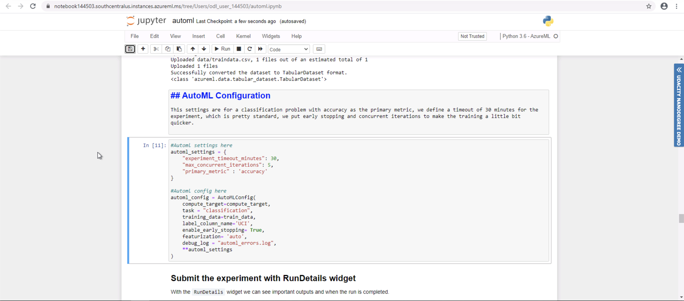

### AutoML Results
*TODO*: What are the results you got with your automated ML model? What were the parameters of the model? How could you have improved it?

*TODO* Remeber to provide screenshots of the `RunDetails` widget as well as a screenshot of the best model trained with it's parameters.

In our experiment we found that `VotingEnsemble` was the model with the most accuracy, with `0.6459`

The following screenshots are from the results from the experiment run:
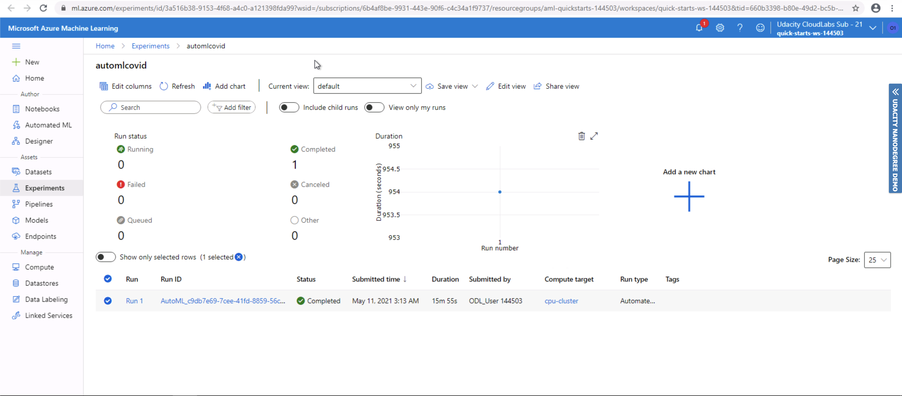

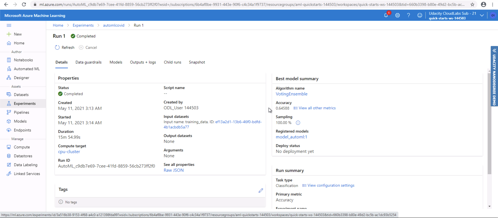

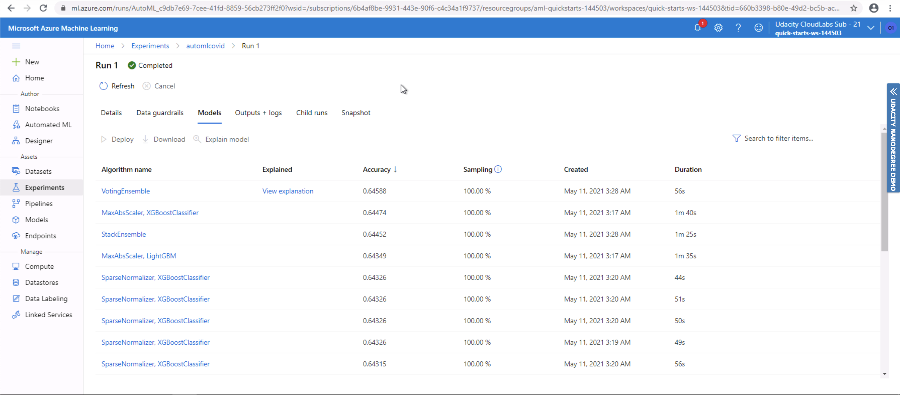

In this two screenshots we can see the feature importance from our AutoML model, we can see the 4 most important features are:

1. NEUMONIA (Pneumonia)
2. RESULTADO_LAB (Lab Result)
3. EDAD (Age)
4. OBESIDAD (Obesity)

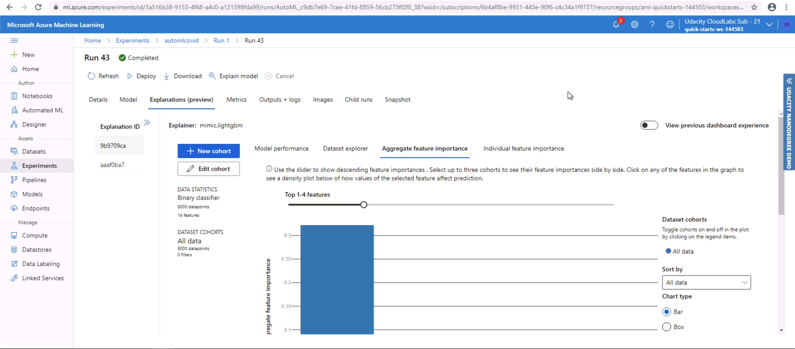

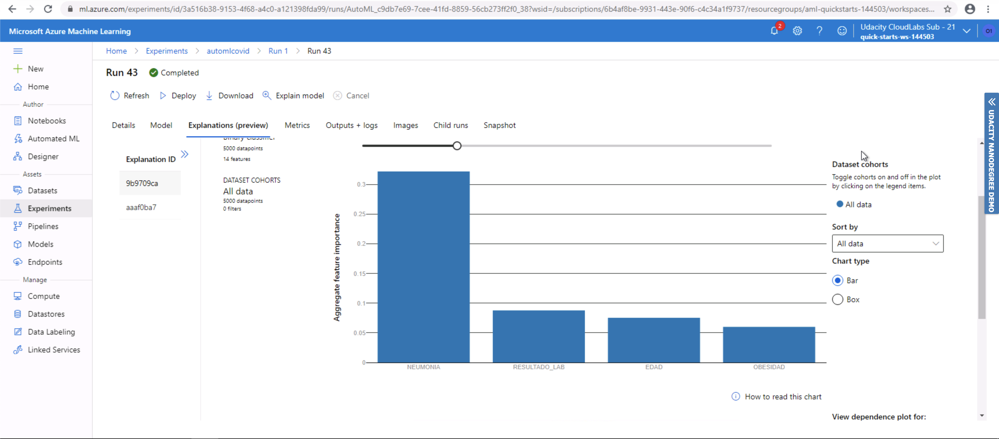

In the screenshots below we can see the result of the RunDetails widget:

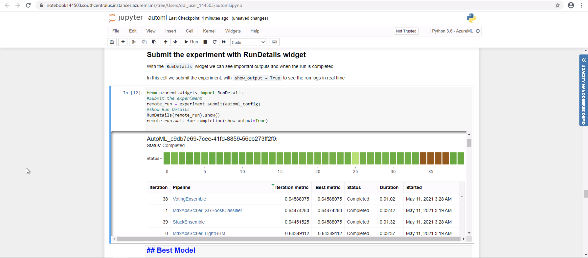

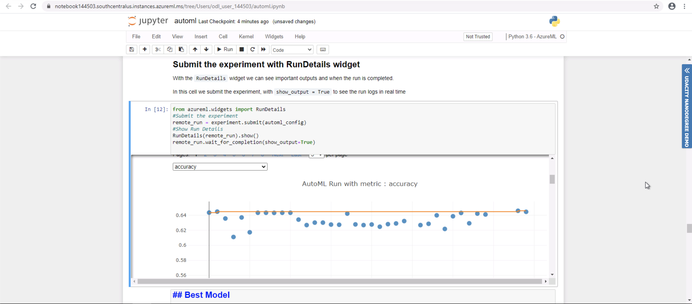

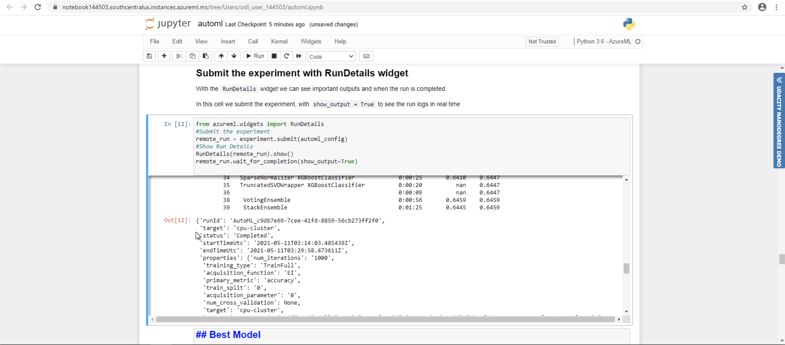

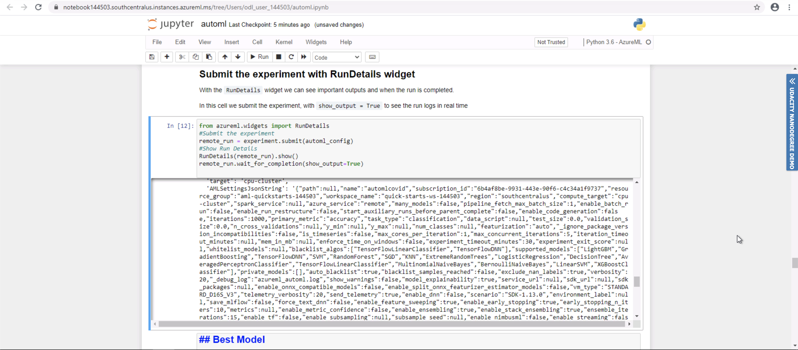

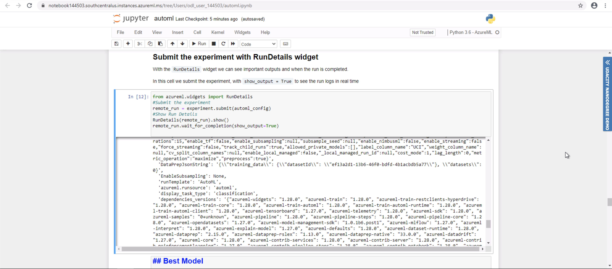

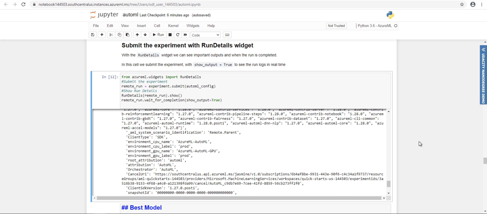

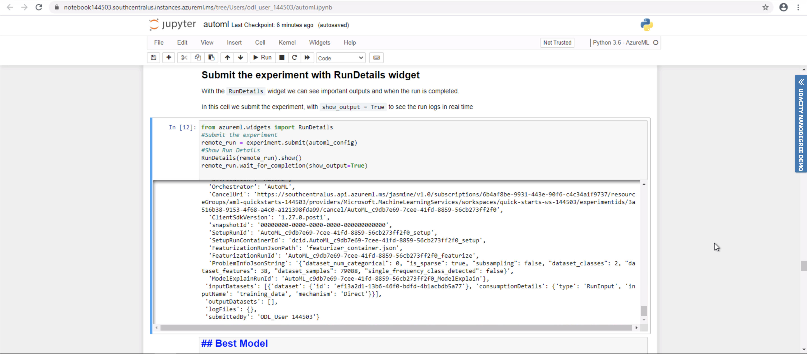

This are the metrics for the best run.

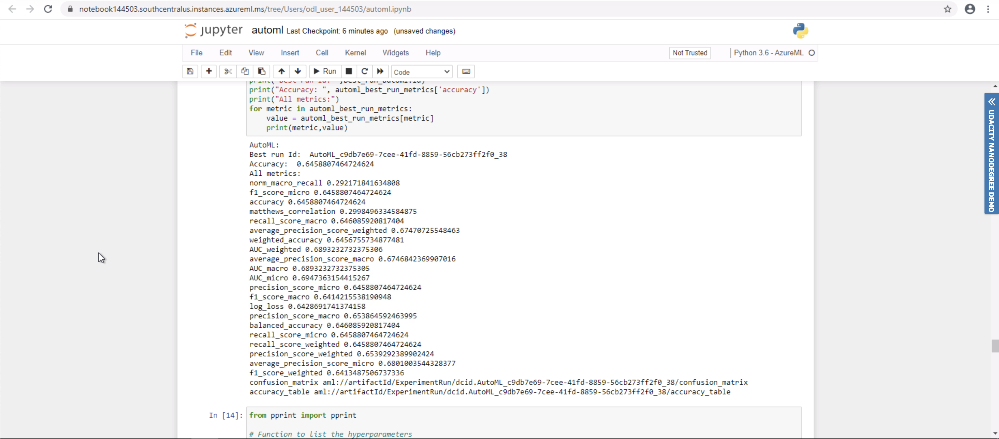

The details of the parameters for this model are described below:
```Python
datatransformer
{'enable_dnn': False,
 'enable_feature_sweeping': True,
 'feature_sweeping_config': {},
 'feature_sweeping_timeout': 86400,
 'featurization_config': None,
 'force_text_dnn': False,
 'is_cross_validation': False,
 'is_onnx_compatible': False,
 'observer': None,
 'task': 'classification',
 'working_dir': '/mnt/batch/tasks/shared/LS_root/mounts/clusters/notebook144503/code/Users/odl_user_144503'}

prefittedsoftvotingclassifier
{'estimators': ['1', '0', '10', '9', '7', '25', '31', '33', '24', '29'],
 'weights': [0.07692307692307693,
             0.15384615384615385,
             0.07692307692307693,
             0.07692307692307693,
             0.15384615384615385,
             0.15384615384615385,
             0.07692307692307693,
             0.07692307692307693,
             0.07692307692307693,
             0.07692307692307693]}

1 - maxabsscaler
{'copy': True}

1 - xgboostclassifier
{'base_score': 0.5,
 'booster': 'gbtree',
 'colsample_bylevel': 1,
 'colsample_bynode': 1,
 'colsample_bytree': 1,
 'gamma': 0,
 'learning_rate': 0.1,
 'max_delta_step': 0,
 'max_depth': 3,
 'min_child_weight': 1,
 'missing': nan,
 'n_estimators': 100,
 'n_jobs': 1,
 'nthread': None,
 'objective': 'binary:logistic',
 'random_state': 0,
 'reg_alpha': 0,
 'reg_lambda': 1,
 'scale_pos_weight': 1,
 'seed': None,
 'silent': None,
 'subsample': 1,
 'tree_method': 'auto',
 'verbose': -10,
 'verbosity': 0}

0 - maxabsscaler
{'copy': True}

0 - lightgbmclassifier
{'n_jobs': 1,
 'problem_info': ProblemInfo(
    dataset_samples=79088,
    dataset_features=38,
    dataset_classes=2,
    dataset_num_categorical=0,
    dataset_categoricals=None,
    pipeline_categoricals=None,
    dataset_y_std=None,
    dataset_uid=None,
    subsampling=False,
    task='classification',
    metric=None,
    num_threads=1,
    pipeline_profile='none',
    is_sparse=True,
    runtime_constraints={'mem_in_mb': None, 'wall_time_in_s': None, 'total_wall_time_in_s': 31449600, 'cpu_time_in_s': None, 'num_processes': None, 'grace_period_in_s': None},
    constraint_mode=1,
    cost_mode=1,
    training_percent=None,
    num_recommendations=1,
    model_names_whitelisted=None,
    model_names_blacklisted=None,
    kernel='linear',
    subsampling_treatment='linear',
    subsampling_schedule='hyperband_clip',
    cost_mode_param=None,
    iteration_timeout_mode=0,
    iteration_timeout_param=None,
    feature_column_names=None,
    label_column_name=None,
    weight_column_name=None,
    cv_split_column_names=None,
    enable_streaming=None,
    timeseries_param_dict=None,
    gpu_training_param_dict={'processing_unit_type': 'cpu'}
),
 'random_state': None}

10 - sparsenormalizer
{'copy': True, 'norm': 'l1'}

10 - xgboostclassifier
{'base_score': 0.5,
 'booster': 'gbtree',
 'colsample_bylevel': 1,
 'colsample_bynode': 1,
 'colsample_bytree': 0.7,
 'eta': 0.2,
 'gamma': 0,
 'learning_rate': 0.1,
 'max_delta_step': 0,
 'max_depth': 7,
 'max_leaves': 31,
 'min_child_weight': 1,
 'missing': nan,
 'n_estimators': 10,
 'n_jobs': 1,
 'nthread': None,
 'objective': 'reg:logistic',
 'random_state': 0,
 'reg_alpha': 0,
 'reg_lambda': 0.625,
 'scale_pos_weight': 1,
 'seed': None,
 'silent': None,
 'subsample': 1,
 'tree_method': 'auto',
 'verbose': -10,
 'verbosity': 0}

9 - sparsenormalizer
{'copy': True, 'norm': 'max'}

9 - xgboostclassifier
{'base_score': 0.5,
 'booster': 'gbtree',
 'colsample_bylevel': 1,
 'colsample_bynode': 1,
 'colsample_bytree': 0.7,
 'eta': 0.001,
 'gamma': 0,
 'learning_rate': 0.1,
 'max_delta_step': 0,
 'max_depth': 4,
 'max_leaves': 7,
 'min_child_weight': 1,
 'missing': nan,
 'n_estimators': 100,
 'n_jobs': 1,
 'nthread': None,
 'objective': 'reg:logistic',
 'random_state': 0,
 'reg_alpha': 0.3125,
 'reg_lambda': 1.875,
 'scale_pos_weight': 1,
 'seed': None,
 'silent': None,
 'subsample': 1,
 'tree_method': 'auto',
 'verbose': -10,
 'verbosity': 0}

7 - sparsenormalizer
{'copy': True, 'norm': 'l2'}

7 - xgboostclassifier
{'base_score': 0.5,
 'booster': 'gbtree',
 'colsample_bylevel': 1,
 'colsample_bynode': 1,
 'colsample_bytree': 0.9,
 'eta': 0.3,
 'gamma': 0,
 'learning_rate': 0.1,
 'max_delta_step': 0,
 'max_depth': 9,
 'max_leaves': 0,
 'min_child_weight': 1,
 'missing': nan,
 'n_estimators': 25,
 'n_jobs': 1,
 'nthread': None,
 'objective': 'reg:logistic',
 'random_state': 0,
 'reg_alpha': 0,
 'reg_lambda': 0.7291666666666667,
 'scale_pos_weight': 1,
 'seed': None,
 'silent': None,
 'subsample': 0.9,
 'tree_method': 'auto',
 'verbose': -10,
 'verbosity': 0}

25 - standardscalerwrapper
{'class_name': 'StandardScaler',
 'copy': True,
 'module_name': 'sklearn.preprocessing._data',
 'with_mean': False,
 'with_std': False}

25 - xgboostclassifier
{'base_score': 0.5,
 'booster': 'gbtree',
 'colsample_bylevel': 1,
 'colsample_bynode': 1,
 'colsample_bytree': 0.9,
 'eta': 0.3,
 'gamma': 5,
 'learning_rate': 0.1,
 'max_delta_step': 0,
 'max_depth': 0,
 'max_leaves': 255,
 'min_child_weight': 1,
 'missing': nan,
 'n_estimators': 25,
 'n_jobs': 1,
 'nthread': None,
 'objective': 'reg:logistic',
 'random_state': 0,
 'reg_alpha': 2.1875,
 'reg_lambda': 2.291666666666667,
 'scale_pos_weight': 1,
 'seed': None,
 'silent': None,
 'subsample': 1,
 'tree_method': 'auto',
 'verbose': -10,
 'verbosity': 0}

31 - sparsenormalizer
{'copy': True, 'norm': 'l2'}

31 - xgboostclassifier
{'base_score': 0.5,
 'booster': 'gbtree',
 'colsample_bylevel': 1,
 'colsample_bynode': 1,
 'colsample_bytree': 0.6,
 'eta': 0.1,
 'gamma': 0.01,
 'learning_rate': 0.1,
 'max_delta_step': 0,
 'max_depth': 9,
 'max_leaves': 511,
 'min_child_weight': 1,
 'missing': nan,
 'n_estimators': 10,
 'n_jobs': 1,
 'nthread': None,
 'objective': 'reg:logistic',
 'random_state': 0,
 'reg_alpha': 0,
 'reg_lambda': 1.4583333333333335,
 'scale_pos_weight': 1,
 'seed': None,
 'silent': None,
 'subsample': 1,
 'tree_method': 'auto',
 'verbose': -10,
 'verbosity': 0}

33 - standardscalerwrapper
{'class_name': 'StandardScaler',
 'copy': True,
 'module_name': 'sklearn.preprocessing._data',
 'with_mean': False,
 'with_std': False}

33 - xgboostclassifier
{'base_score': 0.5,
 'booster': 'gbtree',
 'colsample_bylevel': 1,
 'colsample_bynode': 1,
 'colsample_bytree': 0.5,
 'eta': 0.4,
 'gamma': 0,
 'learning_rate': 0.1,
 'max_delta_step': 0,
 'max_depth': 5,
 'max_leaves': 0,
 'min_child_weight': 1,
 'missing': nan,
 'n_estimators': 25,
 'n_jobs': 1,
 'nthread': None,
 'objective': 'reg:logistic',
 'random_state': 0,
 'reg_alpha': 0.7291666666666667,
 'reg_lambda': 2.3958333333333335,
 'scale_pos_weight': 1,
 'seed': None,
 'silent': None,
 'subsample': 0.9,
 'tree_method': 'auto',
 'verbose': -10,
 'verbosity': 0}

24 - maxabsscaler
{'copy': True}

24 - lightgbmclassifier
{'n_jobs': 1,
 'problem_info': ProblemInfo(
    dataset_samples=79088,
    dataset_features=38,
    dataset_classes=2,
    dataset_num_categorical=0,
    dataset_categoricals=None,
    pipeline_categoricals=None,
    dataset_y_std=None,
    dataset_uid=None,
    subsampling=False,
    task='classification',
    metric=None,
    num_threads=1,
    pipeline_profile='none',
    is_sparse=True,
    runtime_constraints={'mem_in_mb': None, 'wall_time_in_s': None, 'total_wall_time_in_s': 31449600, 'cpu_time_in_s': None, 'num_processes': None, 'grace_period_in_s': None},
    constraint_mode=1,
    cost_mode=1,
    training_percent=None,
    num_recommendations=1,
    model_names_whitelisted=None,
    model_names_blacklisted=None,
    kernel='linear',
    subsampling_treatment='linear',
    subsampling_schedule='hyperband_clip',
    cost_mode_param=None,
    iteration_timeout_mode=0,
    iteration_timeout_param=None,
    feature_column_names=None,
    label_column_name=None,
    weight_column_name=None,
    cv_split_column_names=None,
    enable_streaming=None,
    timeseries_param_dict=None,
    gpu_training_param_dict={'processing_unit_type': 'cpu'}
),
 'random_state': None}

29 - maxabsscaler
{'copy': True}

29 - randomforestclassifier
{'bootstrap': False,
 'ccp_alpha': 0.0,
 'class_weight': None,
 'criterion': 'gini',
 'max_depth': None,
 'max_features': 0.05,
 'max_leaf_nodes': None,
 'max_samples': None,
 'min_impurity_decrease': 0.0,
 'min_impurity_split': None,
 'min_samples_leaf': 0.01,
 'min_samples_split': 0.01,
 'min_weight_fraction_leaf': 0.0,
 'n_estimators': 400,
 'n_jobs': 1,
 'oob_score': False,
 'random_state': None,
 'verbose': 0,
 'warm_start': False}
```

Finally, this is a screenshot of saving and registering the best model:

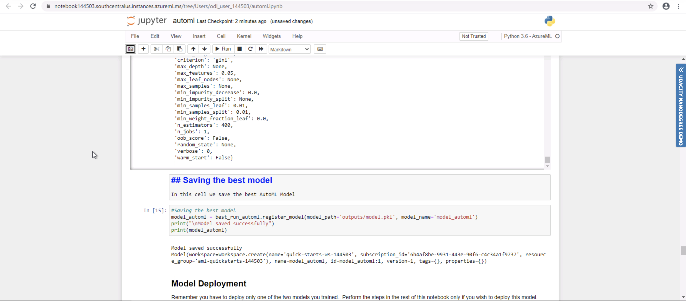

### Possible Impromevents for AutoML

1. We could use a different primary metric as in some cases accuracy is not the best metric for all problems.
2. Adding cross validations to the AutoML configuration may reduce the bias in the model, even though the training data is already balanced.

## Hyperparameter Tuning
*TODO*: What kind of model did you choose for this experiment and why? Give an overview of the types of parameters and their ranges used for the hyperparameter search

For this experiment we use logistic regression from the SKlearn framework with HyperDrive and hyperparameter tuning. There are two hyperparameters for this experiment:

- C: The inverse regularization strength.
- Max_iter: The maximum iteration to converge for the SKLearn Logistic Regression.

For sampling we defined RandomParameterSampling, this defines random sampling over a hyperparameter search space. RandomParameterSampling is one of the choices available for the sampler, it was chosen because it supports early termination of low-performance runs, with this sampler we are still able to find reasonably good models when compared to other sampler policies such as GridParameterSampling or BayesianParameterSampling that exhaustively searches over all the hyperparameter space.

The parameter search space used for C is `[0.01, 0.1, 1]` and for max_iter is `[20, 40, 60, 80, 100, 120, 140, 160, 180, 200]`

The benchmark metric is accuracy.

The early stopping policy is used to stop poorly performing runs. Specifically, the BanditPolicy cuts more runs than other early stopping policies, that's why it was chosen.

It was run with the following configuration parameters:
```Python
policy = BanditPolicy(slack_factor = 0.1, evaluation_interval=1, delay_evaluation=5)
```

- slack_factor: The ammount specifies the allowable slack as a ratio, in the run with the highest accuracy.
- evaluation_interval: The frequency for applying the policy. It counts as one interval for each log of the primary metric by the script.
- delay_evaluation: For the a specified number of intervals delays the first policy evaluation.

### Hyperdrive Results
*TODO*: What are the results you got with your model? What were the parameters of the model? How could you have improved it?

*TODO* Remeber to provide screenshots of the `RunDetails` widget as well as a screenshot of the best model trained with it's parameters.

### Possible Improvements for Hyperdrive

1. Use BayesianParameterSampling instead of RandomParameterSampling, Bayesian sampling is based on the Bayesian optimization algorithm and makes intelligent choices on the hyperparameter values to sample next. It picks the sample based on how the previous samples performed, such that the new sample improves the reported primary metric.
2. Add more values for regularization strength.
3. We could use another metric that is not accuracy, as sometimes it is not the best primary metric for a model.
4. Increasing maximum total runs to test more combinations of hyperparameters, even though this would mean more training time.

## Model Deployment
*TODO*: Give an overview of the deployed model and instructions on how to query the endpoint with a sample input.

To deploy the model we need the following:
- A trained model.
- Inference configuration, with entry script and environment dependencies.
- Deployment configuration with Azure Container Instances.

A scoring script is generated when a model is created. This describes the input data that model will expect and passes it to the model for prediction, and then it returns the results.

The environment can be retrieved by using the `best_run.get_environment()`

For deployment we will use Azure Container Instances with the following configuration:

- cpu_cores = 1
- memory_gb = 1
- auth_enabled = True
- enable_app_insights = True
- description='Covid 19 ICU Prediction Model'

## Screen Recording
This recording demostrates:

- A working model
- Demo of the deployed  model
- Demo of a sample request sent to the endpoint and its response

The recording is available from this URL: https://youtu.be/rrCruXYm6J4

## References
- [Mexican Government's General Directorate of Epidemiology COVID-19 Open Data](https://www.gob.mx/salud/documentos/datos-abiertos-152127)
- [Udacity project starter files](https://github.com/udacity/nd00333-capstone/tree/master/starter_file)
- [Azure Machine Learning SDK for Python](https://docs.microsoft.com/en-us/python/api/overview/azure/ml/?view=azure-ml-py)
- [imblearn RandomUnderSampler class](https://imbalanced-learn.org/dev/references/generated/imblearn.under_sampling.RandomUnderSampler.html)
- [AutoML Config class data](https://docs.microsoft.com/en-us/python/api/azureml-train-automl-client/azureml.train.automl.automlconfig.automlconfig?view=azure-ml-py)
- [Random Parameter Sampling Class](https://docs.microsoft.com/en-us/python/api/azureml-train-core/azureml.train.hyperdrive.randomparametersampling?view=azure-ml-py)
- [Hyperparameter tuning a model with Azure Machine Learning](https://docs.microsoft.com/en-us/azure/machine-learning/how-to-tune-hyperparameters)
- [Exam DP-100 Topic 4 Question 36 Discussion](https://www.examtopics.com/discussions/microsoft/view/36687-exam-dp-100-topic-4-question-36-discussion/)
- [Azure bandit_policy documentation](https://www.rdocumentation.org/packages/azuremlsdk/versions/1.10.0/topics/bandit_policy)
- [Define Bayesian sampling over a hyperparameter search space](https://azure.github.io/azureml-sdk-for-r/reference/bayesian_parameter_sampling.html)
- [pprint library](https://docs.python.org/3/library/pprint.html)